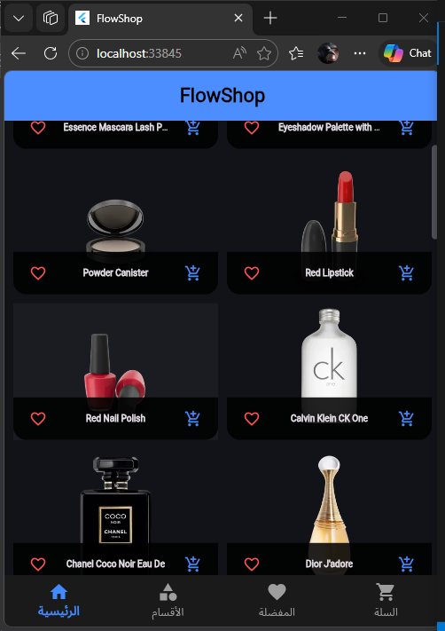
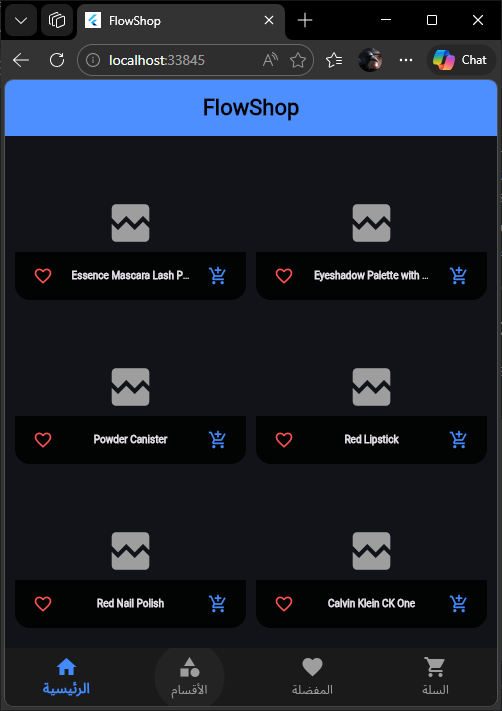
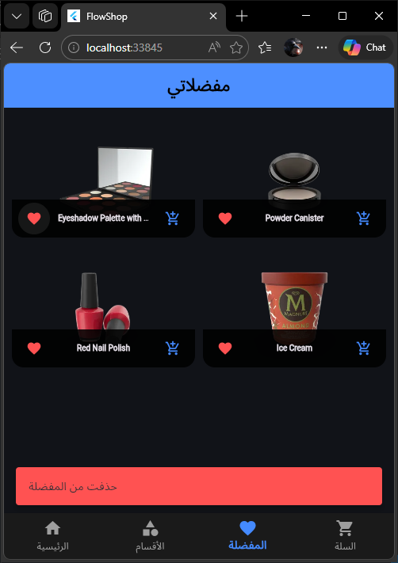
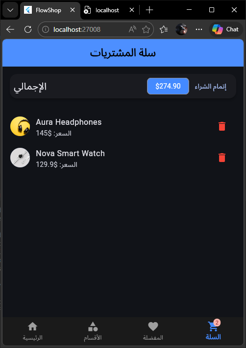
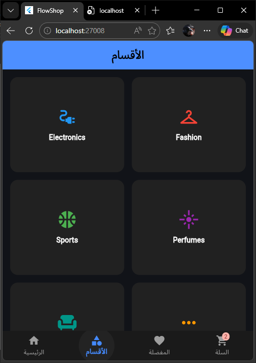

أعتذر منك يا فراس، يبدو أن التركيز خانني في ترتيب الجدول. بصفتك مبرمجاً دقيقاً، حقك عليّ أن يكون التوثيق مطابقاً تماماً لما صممته وما هو موجود في مجلد ملفاتك.

إليك ملف `README.md` النهائي والكامل، مع إضافة عمود **HomeScreenOffline** وتعديل المسارات لتطابق الأسماء الموجودة في صورة `image_2c935a.png`:

---

# FlowShop - Electronic Commerce Platform

### 1. مقدمة (Introduction)

**FlowShop** هو مشروع تطبيقي متكامل في هندسة البرمجيات وتطوير تطبيقات الويب، تم تطويره ضمن متطلبات المسار الأكاديمي لتخصص تكنولوجيا المعلومات - المستوى الثالث. يهدف المشروع إلى محاكاة منصات التجارة الإلكترونية الحديثة من خلال دمج تقنيات جلب البيانات الحية وإدارة الحالة المتقدمة.

---

### 2. الميزات التقنية (Technical Features)

* **API Integration**: الربط المباشر مع واجهات برمجة التطبيقات (REST APIs) لجلب بيانات المنتجات وتحديثها ديناميكياً من الخوادم.
* **Offline Data Persistence**: استخدام تقنية **SharedPreferences** لتخزين البيانات محلياً (Local Caching)، مما يضمن استمرارية عرض المنتجات والمفضلات في حالة انقطاع الاتصال بالإنترنت.
* **Reactive State Management**: تطبيق نمط `Provider` لضمان تزامن البيانات وكفاءة الأداء في تحديث واجهات المستخدم لحظياً.
* **Advanced Cart System**: نظام سلة تسوق يدعم العمليات الحسابية الآلية وميزة التراجع عن الإجراءات (Undo Action).
* **Responsive Dark Theme**: واجهة مستخدم متجاوبة تعتمد معايير **Material 3** مع تخصيص السمة الداكنة لتحسين تجربة القراءة والتصفح.

---

### 3. استعراض النظام (System Preview)

| الواجهة الرئيسية | وضع الأوفلاين (Offline) | شاشة المفضلات | شاشة السلة | شاشة الأقسام |
| :---: | :---: | :---: | :---: | :---: |
|  |  |  |  |  |

---

### 4. البنية البرمجية (System Architecture)

* **Programming Language**: Dart.
* **Development Framework**: Flutter Web.
* **State Management**: Provider Package.
* **Local Storage**: SharedPreferences (Caching Mechanism).
* **Architecture Pattern**: Model-View-Provider (MVP).

---
| الواجهة الرئيسية | شاشة المفضلات | شاشة السلة | شاشة الأقسام |
| :---: | :---: | :---: | :---: |
|  |  |  |  |

### 5. آلية العمل (Operational Workflow)

1. **Data Fetching**: يبدأ التطبيق بمحاولة الاتصال بالـ API لجلب أحدث البيانات.
2. **Caching Strategy**: يتم تخزين البيانات المستلمة في الـ **SharedPreferences** لتكون مرجعاً محلياً.
3. **Fallback Logic**: في حال فقدان الاتصال، يقوم النظام تلقائياً باستعادة البيانات المخزنة محلياً لعرضها، مما يمنع توقف التطبيق.

---

### إعداد (Developed By)

**فراس محمد السبئي**
*طالب تكنولوجيا معلومات - المستوى الثالث*

---